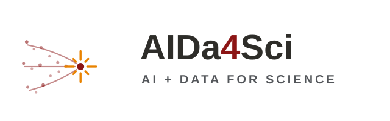

::: {.hero}
{.hero-lockup fig-alt="AIDa4Sci: AI + Data for Science"}

::: {.hero-tagline}
A Stanford seminar series highlighting remarkable scientific advances
and research enabled by AI and novel data.
:::

::: {.hero-buttons}
[View the Schedule](schedule.qmd){.btn .btn-primary}
[Past Quarters](past.qmd){.btn .btn-outline-secondary}
:::
:::

::: {.info-cards}
::: {.info-card}
### When
Wednesdays, 4:30–5:30 pm Fall quarter 2026
:::

::: {.info-card}
### Where
[CoDA E160](https://campus-map.stanford.edu/?srch=CoDA), Stanford University
:::

::: {.info-card}
### Course numbers
STATS 282 · EE 292R · PSYCH 292R 
Enroll via [Axess](https://axess.stanford.edu)
:::
:::

## About the seminar

Our aim is to bring together speakers from our community and industry
to highlight remarkable scientific advances and research enabled by AI
and novel data. We are particularly interested in the exciting work
being done on Stanford's new GPU cluster,
[Marlowe](https://datascience.stanford.edu/marlowe). Our goal is to
communicate this research and share ideas that may be useful to a
broad community of researchers.

The seminar is open to the Stanford community. Students may enroll
under any of the cross-listed course numbers
([STATS 282](https://explorecourses.stanford.edu/search?view=catalog&q=STATS+282),
EE 292R, PSYCH 292R).

## Organizers

::: {.organizers}
::: {.organizer}
[Emmanuel Candès](https://candes.su.domains)
[Statistics & Mathematics]{.dept}
:::

::: {.organizer}
[Balasubramanian Narasimhan](https://naras.su.domains)
[Statistics & Biomedical Data Science]{.dept}
:::

::: {.organizer}
[Brian Wandell](https://wandell.vista.su.domains/blog/)
[Psychology]{.dept}
:::

::: {.organizer}
[Gordon Wetzstein](https://stanford.edu/~gordonwz/)
[Electrical Engineering]{.dept}
:::
:::
